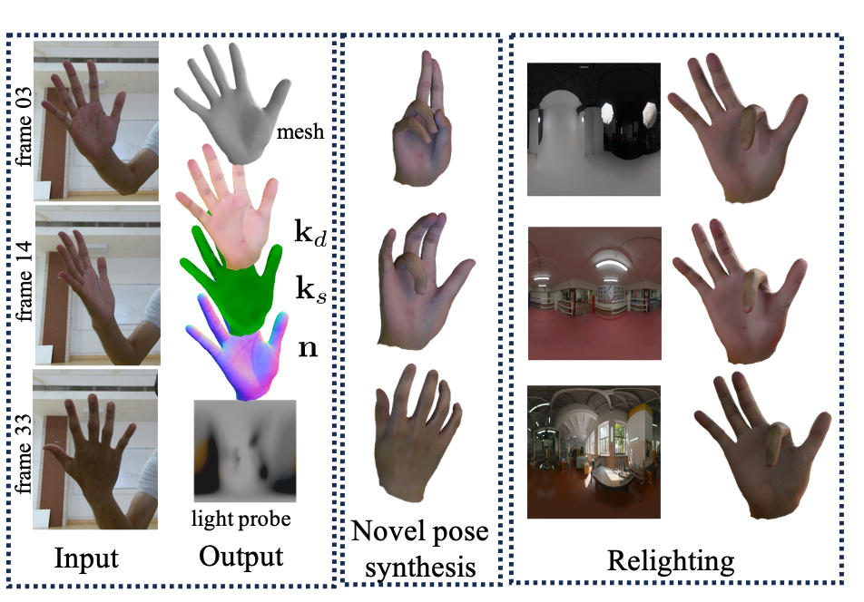

# Intrinsic Hand Avatar 




> __Intrinsic Hand Avatar: Illumination-aware Hand Appearance and Shape Reconstruction from Monocular RGB Video__  
> [Pratik Kalshetti](https://www.cse.iitb.ac.in/~pratikm), [Parag Chaudhuri](https://www.cse.iitb.ac.in/~paragc) <br>
> _IEEE/CVF Winter Conference on Applications of Computer Vision (__WACV__), 2024_  
> __[Paper](https://www.cse.iitb.ac.in/~pratikm/data/publications/papers/2024_wacv_intrinsic_hand.pdf)__

This is the official code repository of our paper.

## Installation

### 1. Setup environment
```bash
cd env
source create_env.sh
source activate_dev_env.sh
cd ..
```

### 2. Download data to `./data`

- Download InterHand2.6M (5fps) dataset from https://mks0601.github.io/InterHand2.6M/
- Download MANO hand model from https://mano.is.tue.mpg.de/
- Download HTML model from https://handtracker.mpi-inf.mpg.de/projects/HandTextureModel/

The folder structure should be as follows:
```
${ROOT}
|-- data
|   |-- html
|   |   |-- TextureBasis
|   |   |-- TextureSet
|   |   |-- ...
|   |-- interhand
|   |   |-- annotations
|   |   |-- images
|   |-- mano
|   |   |-- models
|   |   |-- webuser
|   |   |-- ...
```

## Usage

Reconstruct shape and appearance for `test/Capture1/ROM03_RT_No_Occlusion/cam400270`.

```bash
python scripts/reconstruct_iha.py
```

Results will be saved in `./output/log/iha_on_interhand/`.


## License

Distributed under the MIT License. See `LICENSE.txt` for more information.

## Citation

```bibtex
@inproceedings{kalshetti2024intrinsichand,
    title = {Intrinsic Hand Avatar: Illumination-aware Hand Appearance and Shape Reconstruction from Monocular RGB Video},
    author = {Pratik Kalshetti and Parag Chaudhuri},
    booktitle = {Proceedings of the IEEE/CVF Winter Conference on Applications of Computer Vision (WACV)},
    year = {2024}
}
```

## Acknowledgments
This project makes use of a number of awesome open source libraries, including:
* [nvdiffrecmc](https://github.com/NVlabs/nvdiffrecmc)
* [HandAvatar](https://github.com/SeanChenxy/HandAvatar)
* [neural-head-avatars](https://github.com/philgras/neural-head-avatars)

Many thanks to the authors of these brilliant projects!

